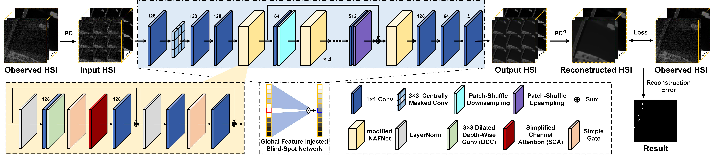

# PUNNet
This is the official repository for  ["Global Feature-Injected Blind-Spot Network for Hyperspectral Anomaly Detection"](https://ieeexplore.ieee.org/document/10648847) in IEEE Geoscience and Remote Sensing Letters (GRSL). 



## Abstract

Hyperspectral anomaly detection (HAD) poses the challenge of distinguishing anomalous targets from the majority of background objects without prior knowledge. Most existing deep learning (DL) models struggle to account for both local and global spatial-spectral features in the image, limiting their performance. In this letter, we introduce PUNNet, which integrates the patch-shuffle downsampling technique and nonlinear activation-free network (NAFNet) block with dilated convolution into an advanced blind-spot network for HAD. Specifically, PUNNet utilizes the patch-shuffle downsampling operation to extend its receptive field and exploits channel attention in the NAFNet block with dilated convolution to capture global contextual information in the image. Meanwhile, PUNNet satisfies the blind-spot requirement, meaning its receptive field excludes the center pixel’s information. This allows for reliable and precise background reconstruction in a self-supervised learning paradigm, further weakening anomalous feature expression and increasing the reconstruction error of anomalies. Experimental results demonstrate that PUNNet achieves a leading position in HAD performance. The code is available at https://github.com/DegangWang97/IEEE_GRSL_PUNNet.

## Setup

### Requirements

Our experiments are done with:

- Python 3.9.12
- PyTorch 1.12.1
- numpy 1.21.5
- scipy 1.7.3
- torchvision 0.13.1

## Prepare Dataset

Put the data(.mat [data, map]) into ./data

## Training and Testing

### Training
```shell
python main.py --command train --dataset HSI-II --epochs 1500 --learning_rate 1e-4 --factor 2 --gpu_ids 0
```

### Testing
```shell
python main.py --command predict --dataset HSI-II --epochs 1500 --learning_rate 1e-4 --factor 2 --gpu_ids 0
```

- If you want to Train and Test your own data, you can change the input dataset name (dataset) and tune the parameters, such as Learning rate (learning_rate), PD stride factor (factor).

## Citation

If the work or the code is helpful, please cite the paper:

```
@article{wang2024punnet,
  author={Wang, Degang and Zhuang, Lina and Gao, Lianru and Sun, Xu and Zhao, Xiaobin},
  journal={IEEE Geosci. Remote Sens. Lett.}, 
  title={Global Feature-Injected Blind-Spot Network for Hyperspectral Anomaly Detection}, 
  year={2024},
  volume={21},
  pages={1-5},
  DOI={10.1109/LGRS.2024.3449635}
}
```

## Acknowledgement

The codes are based on [AP-BSN](https://github.com/wooseoklee4/AP-BSN) and [PUCA](https://github.com/HyemiEsme/PUCA). Thanks for their awesome work.

## Contact
For further questions or details, please directly reach out to wangdegang20@mails.ucas.ac.cn
